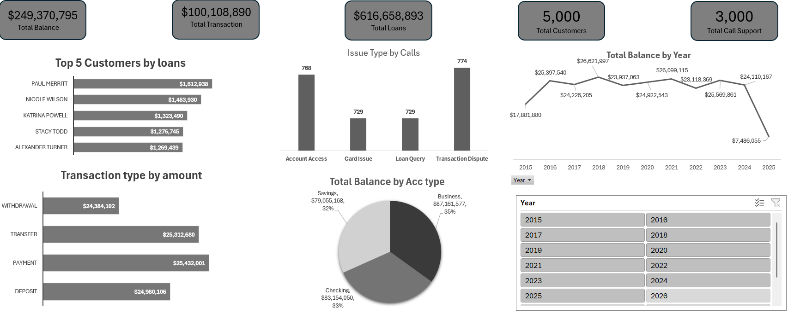

# Banking Analytics Dashboard Excel

## Project Overview
An end-to-end Data Analytics project examining bank transactions, customer balances, loan distributions, and customer support metrics. Built using Excel, Power Query, and Pivot Tables to clean, model, and visualize data for strategic banking insights.

---

## Key Insights & Metrics
- **Financial Volume:** Analyzed **$249.37M** in total balances across **5,000 active customers**.
- **Loan Portfolio:** Evaluated **$616.65M** in total loans, identifying top borrowing accounts for risk and relationship management.
- **Support Operations:** Assessed **3,000 customer service call tickets**, identifying *Transaction Disputes* (774 calls) and *Account Access* (768 calls) as the top operational drivers.
- **Account Type Distribution:** Balanced portfolio spread across **Business (35%)**, **Checking (33%)**, and **Savings (32%)**.

---

## Tools & Techniques Used
- **Power Query:** Data extraction, transformations, type casting, handling null values, and custom column logic.
- **Pivot Tables & Data Modeling:** Calculated totals, summarized complex transactional data, and aggregated multi-year trends.
- **Dashboarding & UX Design:** Dynamic visual dashboard featuring KPI summary cards, customized slicers, horizontal bar charts, and historical trend lines.

---

## Dashboard Preview

---

## Project Files & Dataset
-  **[Download / View Excel Workbook](Banking%20Analytics%20Dashboard%20Excel.xlsx)** *(Full interactive dashboard & data model)*
-  `README.md`: Project documentation and key business insights.
